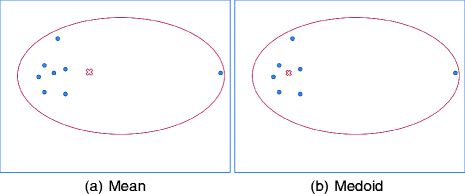
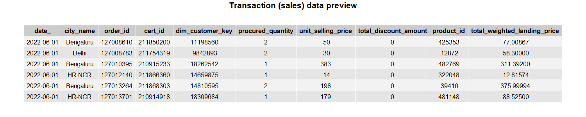
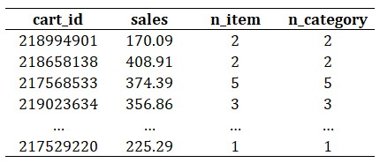
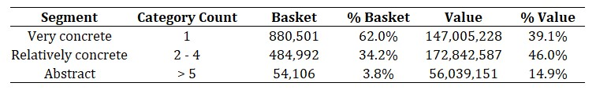
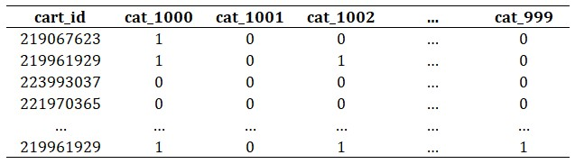
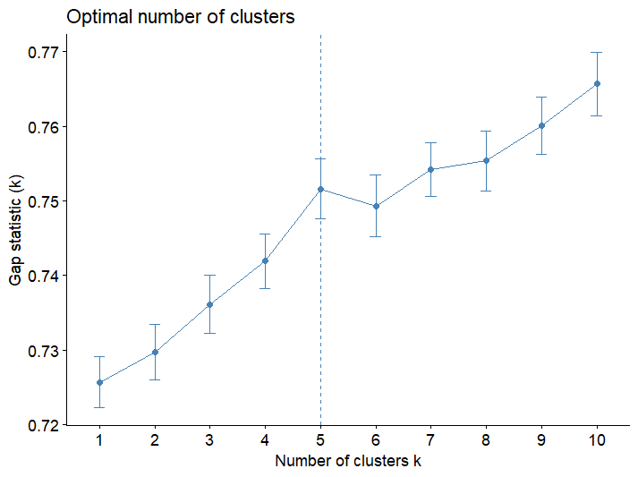
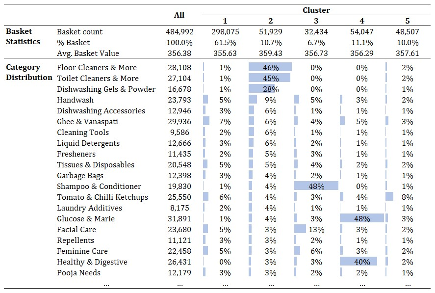

Understanding E-Commerce Consumers Shopping Missions Through Unsupervised Learning
================


*Illustration asset by [freestocks](https://unsplash.com/@freestocks?utm_source=unsplash&utm_medium=referral&utm_content=creditCopyText) on [Unsplash](https://unsplash.com/photos/_3Q3tsJ01nc?utm_source=unsplash&utm_medium=referral&utm_content=creditCopyText)*

# Table of Content
- [Understanding shoppers behavior](#understanding-shoppers-behavior)
    * [Shopping goals](#shopping-goals)
    * [Shopping missions](#shopping-missions)
- [Offline retail store and online commerce](#offline-retail-store-and-online-commerce)
- [Clustering analysis](#clustering-analysis)
- [Shopping missions identification](#shopping-missions-identification)
  * [Data preparation](#data-preparation)
  * [Segmenting shopping goal](#segmenting-shopping-goal)
  * [Identifying shopping mission](#identifying-shopping-mission)
  * [Results](#results)
- [Closing thoughts](#closing-thoughts)
- [References](#references)

---

Human beings have certain needs. Those needs can be categorized into three distinct groups: primary, secondary, and tertiary needs. To address these needs, we, as humans do shopping, While some individuals adopt a regular and structured approach to shopping, adhering to monthly, weekly, or even daily schedules, others are inclined towards more impulsive buying habits. Regardless of the shopping style one adopts, every shopping activity has a specific purpose or mission.

# Understanding shoppers behavior

Before delving deeper, let’s take a look at shopping goals and missions.

## Shopping goals

Concrete shopping goals usually occur when someone wants to buy specific promotional goods or instantly consumable items. This type of shopping goal implies shoppers' trip behavior into swift decision-making and purposely item selection, making the shopping trips efficient. On the other hand, abstract shopping goals stand as an alternative facet of the shopping spectrum. This objective is characterized by its unpredicted and expansive nature, such as purchasing various miscellaneous items in less frequent shopping trips [1].

Addressing the grey area between concreteness and abstractness, there exist relatively concrete or relatively abstract shopping goals. This category of goals treads the middle ground between the stark specificity of concrete goals and the expansiveness of abstract ones. Such goals typically revolve around the replenishment of perishable commodities. These objectives, while less narrowly defined than concrete goals, showcase a noticeable level of specificity that guides shopping trips.

![Conceptual relationship between shopping goals and missions [1].](asset/shopping-goal-and-mission.jpg)

*Conceptual relationship between shopping goals and missions [1].*

## Shopping missions

Shopping trips characterized by very concrete goals often revolve around the confines of a single product category. In such instances, individuals embark on their shopping journey with a distinct item in mind, driven by an explicit intention to acquire that particular product and only that product. Likewise, abstract shopping trips, characterized by their multifaceted nature, encompass an array of different needs housed within various product categories. These trips make shopping missions hard to identify as there are complex relationships among the product categories involved.

In contrast, relatively concrete shopping trips offer a balanced assortment of product categories showcasing specificity and variety. This equilibrium renders such shopping trips conducive to the identification of shopping missions.

# Offline retail store and online commerce

There are distinct disparate aspects between offline retail stores and e-commerce. Offline retail businesses, encompassing the likes of hypermarkets and convenience stores, exhibit a marked dissimilarity in their product assortments. Hypermarkets stand as expansive retail destinations where an extensive variety of goods is readily available. This contrasts with the relatively narrower product spectrum typically found in convenience stores. This dissimilarity casts a significant impact on the dynamics of shoppers' journeys within these offline retail environments.

 on [Unsplash](https://unsplash.com/photos/rWMIbqmOxrY?utm_source=unsplash&utm_medium=referral&utm_content=creditCopyText) and writer on [Exabytes](https://www.exabytes.co.id/blog/apa-itu-e-commerce-adalah/)](asset/offline-retail-vs-ecommerce.jpg)

*Asset illustration by [Nathália Rosa](https://unsplash.com/@nathaliarosa?utm_source=unsplash&utm_medium=referral&utm_content=creditCopyText) on [Unsplash](https://unsplash.com/photos/rWMIbqmOxrY?utm_source=unsplash&utm_medium=referral&utm_content=creditCopyText) and writer on [Exabytes](https://www.exabytes.co.id/blog/apa-itu-e-commerce-adalah/)*

Studies have demonstrated that hypermarket shoppers tend to exhibit a smaller proportion of low-variety categories baskets compared to their counterparts shopping at convenience stores. Convenience store shoppers, characterized by their penchant for swift purchase-and-go behaviors, display an inclination to purchase a few distinctive products. The convenience store setting, tailored for quick and immediate purchases, fosters this behavior, enabling shoppers to efficiently acquire their desired products with minimal fuss.

Moving on to e-commerce, a parallel can be drawn in terms of the variety of products available, akin to the vast product assortments of hypermarkets. However, the unique value that defines e-commerce is the ease with which products can be procured online. This convenience factor, while encouraging frequent purchases, also implies a distinct pattern in consumers' shopping habits. The accessibility and simplicity of online shopping often steer individuals towards the practice of purchasing fewer items but doing so on a more regular basis. While this hypothesis is rooted in personal observations and experiences, further scholarly inquiry is eagerly recommended.

# Clustering analysis

Cluster analysis, commonly referred to as clustering, is the process of categorizing a collection of objects in a manner that aligns objects within the same group, or cluster, based on their degree of similarity to each other. This principle entails that items sharing greater affinities are grouped together within a cluster, forging connections that are more pronounced compared to connections with objects in other clusters. Clustering is categorized as unsupervised learning. Unlike supervised learning, clustering lacks a predefined reference point, or "ground truth," that would enable the assessment of the accuracy of the clustering outcomes.



*Mean vs medoid illustrated [2].*

In this article, the main analysis uses a specific hard clustering technique known as K-Medoids. This method entails the partitioning of data into clusters, where each cluster is represented by a data point termed a "medoid." The K-Medoids algorithm strives to minimize the dissimilarity or distance between data points within a cluster while maximizing the dissimilarity between clusters. To learn more about this kind of clustering, see [2].

# Shopping missions identification

Within this section, I will analyze the shopping baskets of the Flipkart e-commerce platform shoppers. The dataset for this analysis is accessible through [Kaggle](https://www.kaggle.com/datasets/datamonkey121/flipkart-supermart-product-and-transaction-details).

## Data preparation

For simplicity purposes, only June transaction data will be used for the entire analysis. Also, the library `data.table` and `tidyverse` have carried out the entire computation on R Studio.

```r
library(data.table)
library(tidyverse)

setwd(...)

# data importing
sales <- lapply(str_subset(dir(
    file.path("flipkart-supermarket-dataset")
  ), "^fact_sales_jun"), function(filename) {
    fread(file.path("flipkart-supermarket-dataset", filename))
  }) %>% rbindlist()

# remove unnecessary columns
sales[, c("V1", "Unnamed: 0") := NULL]
```



**Product category selection**

In total, there are 205 categories listed on the product database. However, owing to the variance in transactional contributions across these categories over the observed month, a selective analysis is deemed more appropriate. Low-frequency purchase categories (LFC) are considered a refined approach for delineating the segmentation [3], particularly since certain categories, such as fresh vegetables, are frequently purchased by a amass portion of consumers which imbues little information toward the segmentation.

```r
# calculating frequency contribution
purchaseCat <- sales[dimProduct, on = "product_id", nomatch = 0][, .(
  sales = sum(total_weighted_landing_price, na.rm = TRUE),
  purchase_frequency = sum(procured_quantity, na.rm = TRUE)),
  by = "l1_category_id"][order(-purchase_frequency)]
purchaseCat[, pct_pf := cumsum(purchase_frequency)/sum(purchase_frequency)]

# filtering LFC
LFC <- purchaseCat[pct_pf > .8][["l1_category_id"]]
```

To define LFC, I adopted the Pareto principle, thereby filtering out the 80% of categories that collectively contribute to the overarching transaction frequency. This approach aligns with the methodology shown in [3].

**Transaction (sales) data finalization**

```r
# finalizing sales data
summarySales <- sales[dimProduct, on = "product_id", nomatch = 0][
  l1_category_id %in% LFC][, .(
    sales = sum(total_weighted_landing_price, na.rm = TRUE),
    n_item = uniqueN(product_id),
    n_category = uniqueN(l1_category_id)),
    by = "cart_id"][sales > 0]
```

The remaining 20%, or 155, categories are classified as low-frequency categories (LFC), which also corresponds to 34.3% of overall sales generated. The table below depicts the attributes of each basket (aliased as cart), which include basket value (`sales`), distinct item counts (`n_item`), and distinct category counts (`n_category`).



## Segmenting shopping goal

To segment shopping goals, a one-dimensional univariate clustering method was employed [4] [5]. The targeted number of clusters was set at 3, aligning with a theoretical perspective that posits shopping goals can be categorized into three distinct groups. Using the distinct category counts as the input for clustering, the computation was performed 50 times, to avoid local minima, then aggregated, with each iteration considering a fixed-size sub-dataset that is equal to 10% of the original dataset.

```r
library(Ckmeans.1d.dp)

# compute clustering
n.sample <- 50L
CKmeans_partition <- lapply(1:n.sample, function(x) {
  summarySales_sampled <- summarySales %>%
    slice_sample(prop = .10)
  categorySegment <- Ckmeans.1d.dp(summarySales_sampled$n_category, k = 3L)
  summarySales_sample_cluster <- summarySales_sampled %>%
    cbind(data.table(cluster = categorySegment$cluster)) %>%
    group_by(cluster) %>%
    summarize(
      N = uniqueN(cart_id),
      GMV = sum(sales),
      min_cat = min(n_category),
      max_cat = max(n_category)
    )
})

# summarizing results
CKmeans_summary <- CKmeans_partition %>%
  rbindlist() %>%
  group_by(cluster) %>%
  summarize(across(c(N, GMV, min_cat, max_cat), mean)) %>%
  mutate(`% GMV` = GMV/sum(GMV), .after = "GMV") %>%
  mutate(`% N` = N/sum(N), .after = "N") %>%
  select(cluster, `% N`, `% GMV`, min_cat, max_cat) %>%
  arrange(min_cat)

# check results
print(CKmeans_summary)

# applying to sales data
summarySales[, segment := cut(
  n_category, breaks = c(0,1,4,Inf), # based on clustering result, see CKmeans_result
  label = c("Very concrete", "Relatively concrete", "Abstract"),
  include.lowest = TRUE)]
summarySales_SG <- summarySales[, .(basket = .N, value = sum(sales)), by = "segment"]
```

A significant majority, exceeding 60% of the transaction baskets categorized as "very concrete", comprises solely single-category baskets. This outcome aligns with the hypotheses mentioned in the preceding section: the convenience of online e-commerce prompts individuals to opt for smaller, more frequent purchases. 



While the "very concrete" segment contributes the largest proportion of basket counts, the segment "relatively concrete" surpasses others in terms of sales contribution. The 484,992 baskets in “relatively concrete” segment will be utilized to identify shopping missions for the rest of the analysis.

## Identifying shopping mission

Within this section, a second clustering will be performed exclusively on the subset of baskets classified in the "relatively concrete" segment. 

```r
# getting the appropriate segment
segmentRC <- summarySales[segment == 'Relatively concrete']
segmentRC_items <- sales[cart_id %in% segmentRC$cart_id, .(
  cart_id, product_id)][dimProduct, on = "product_id", nomatch = 0][
    l1_category_id %in% LFC]
segmentRC_item <- unique(segmentRC_items[, .(cart_id, l1_category_id)])[
  order(cart_id, l1_category_id)]

# creating participation matrix
participationMatrix <- dcast(
  data = segmentRC_item[, .(cart_id, l1_category_id, value = 1)],
  formula = cart_id ~ paste0("cat_", l1_category_id),
  value.var = "value",
  fill = 0
)
```

For the purpose of this clustering, the data undergoes a transformation into a binary flags matrix. This matrix indicates the presence (1) or absence (0) of a specific product category within a given basket, thereby forming what is referred to as a participation matrix. To effectively capture the dissimilarities existing among each individual basket, Jaccard distance is used as internal metrics for K-Medoids clustering.



Due to the substantial volume of the data, the Clustering for Large Applications (CLARA) algorithm was selected for use, as traditional Partition Around Medoids (PAM) clustering might prove to be inefficient in such a scenario. 

```r
library(clustering)
library(factoextra)

# determining optimal cluster (k)
gapStat <- clusGap(
  x = select(participationMatrix, -cart_id),
  FUNcluster = clara, K.max = 10, B = 80,
	samples = 2^10, metric = "jaccard", pamLike = TRUE
)
fviz_gap_stat(gapStat)

# clustering model training
fit_clara_SM <- clara(select(participationMatrix, -cart_id), k = 5L,
                      metric = "jaccard", pamLike = TRUE)
```

To obtain the optimal cluster, the gap statistics method was chosen. The results indicate that 5 clusters represent the optimal number for this second phase of clustering. This finding implies the establishment of 5 distinct shopping missions as the clustering results.



## Results



Table above depicts the preview of final clustering results. Almost two-thirds of the total baskets have been grouped into a sizable cluster, while the remaining four clusters exhibit a nearly equal distribution amongst themselves.

- Cluster 1, the most extensive cluster in terms of basket count (constituting 61.5% of the total), appears to lack a discernible pattern, which is a somewhat unfortunate outcome given its size.
- Cluster 2 (10.7%), on the other hand, emerges as dominant in categories like Toilet and Floor Cleaners, as well as Dishwashing products, suggesting a mission centered around "**household needs**."
- With a composition of 6.7%, cluster 3 represents a "**personal care**" mission, evidenced by its high participation in products from categories such as Shampoo, Conditioner, and Deodorants.
- Cluster 4 (11.1%) predominantly features items like Glucose & Marie, Rusks & Wafers, and Healthy & Digestive products, embodying a mission revolving around "**light snacks**."
- Lastly, Cluster 5 (10.0%) embodies a "**breakfast**" mission, given its domination by products from categories like Dips & Spreads and Cheese.

While the suggested cluster number was guided by a theoretically sound approach (gap statistics),  the actual clustering outcomes have yielded results that are less than satisfactory. This assertion is largely rooted in the presence of a solitary dominant cluster, which, unfortunately, fails to provide any meaningful insights. Despite the fact that the remaining clusters offer valuable and insightful information, the prominence of this single uninformative cluster raises my concerns. Hence, based on this assessment, it is recommended to refine and expand the experimentation process. By doing so, the objective is to enhance the overall quality of the clustering results, to ensure that they are more representative and informative.

# Closing thoughts

For practitioners, understanding the shopping missions of consumers offers lots of advantages, mainly enabling the implementation of more precise, pertinent, and efficient marketing activities. Retailers can tailor their efforts toward creating specific campaigns that cater to the unique characteristics and preferences associated with each shopping mission. Likewise, by strategically positioning their brands within the framework of various shopping missions, goods manufacturers can capitalize on the opportunity to bolster brand relevance and convenience for shoppers. This involves crafting brand narratives and product placements that align seamlessly with the context of each shopping mission, thereby cultivating a stronger resonance with consumers.

For academicians, there is wide room to explore and experiment with this kind of analysis. Refining data processing techniques, exploring alternative methodologies, or even embracing machine learning-based approaches holds significant promise. The objective is to improve the precision of the shopping mission segmentation so that conclusive insights can be drawn. Huge credit is owed to a published paper authored by Sarantopoulos and friends (see [References](#references)), which served as a profound source of inspiration for this article. An alternative avenue for selecting the experimental subject and the clustering methodology was embarked upon to satisfy the inquisitiveness of the author (me).

---

# References

[1] P. Sarantopoulos, A. Theotokis, K. Pramatari, and G. Doukidis, "Shopping missions: An analytical method for the identification of shopper need states," *J. Bus. Res.*, vol. 69, no. 3, pp. 1043–1052, Mar. 2016. Accessed: Aug. 13, 2023. [Online]. Available: [https://doi.org/10.1016/j.jbusres.2015.08.017](https://doi.org/10.1016/j.jbusres.2015.08.017)

[2] S. Mannor *et al.*, "K-Medoids clustering," in *Encyclopedia of Machine Learning*. Boston, MA: Springer US, 2011, pp. 564–565. Accessed: Aug. 20, 2023. [Online]. Available: [https://doi.org/10.1007/978-0-387-30164-8_426](https://doi.org/10.1007/978-0-387-30164-8_426)

[3] B. von Mutius and A. Huchzermeier, "Customized targeting strategies for category coupons to maximize CLV and minimize cost," *J. Retailing*, Feb. 2021. Accessed: Aug. 2, 2023. [Online]. Available: [https://doi.org/10.1016/j.jretai.2021.01.004](https://doi.org/10.1016/j.jretai.2021.01.004)

[4] M. Song and H. Zhong, "Efficient weighted univariate clustering maps outstanding dysregulated genomic zones in human cancers," *Bioinformatics*, vol. 36, no. 20, pp. 5027–5036, Jul. 2020. Accessed: Aug. 20, 2023. [Online]. Available: [https://doi.org/10.1093/bioinformatics/btaa613](https://doi.org/10.1093/bioinformatics/btaa613)

[5] H. Wang and M. Song, "Ckmeans.1d.dp: Optimal k-means clustering in one dimension by dynamic programming," *R J.*, vol. 3, no. 2, p. 29, 2011. Accessed: Aug. 20, 2023. [Online]. Available: [https://doi.org/10.32614/rj-2011-015](https://doi.org/10.32614/rj-2011-015)

[6] DataMonkey. (2022, November). FlipKart Supermart Product and transaction details. Version 1. Retrieved Aug 13, 2023 from [https://www.kaggle.com/datasets/datamonkey121/flipkart-supermart-product-and-transaction-details](https://www.kaggle.com/datasets/datamonkey121/flipkart-supermart-product-and-transaction-details)
